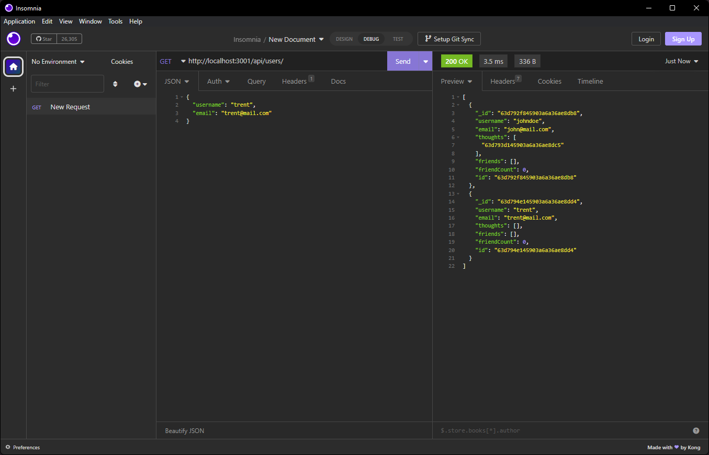
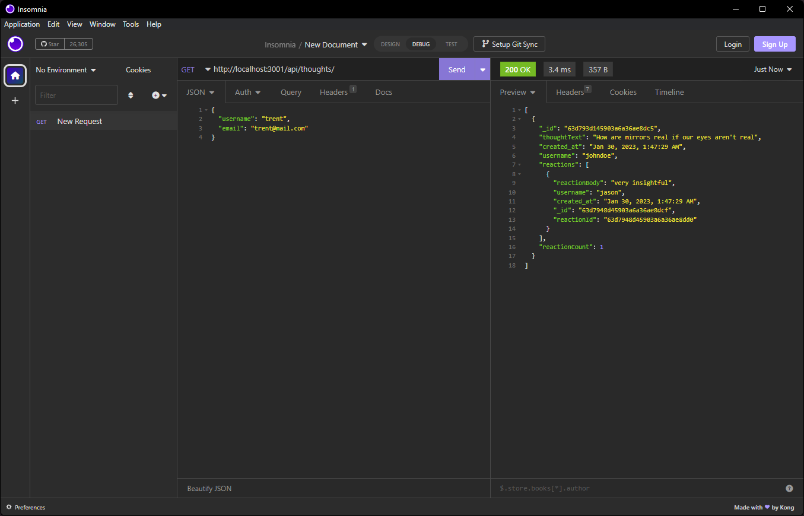

# Social Network API

## Description

This is an API for a social network web application where users can share their thoughts, react to friends' thoughts, and create a friend list. It is built using Express.js for routing, a MongoDB database, and the Mongoose ODM. It also uses date-fns to formate timestamps. This application only features back-end functionality, so the API routes must be tested in an environment such as Insomnia.

## Table of Contents

* [Usage](#usage)

* [License](#license)

* [Credits](#credits)

* [Questions](#questions)

## Usage

After installing After running 'npm i' in the terminal, the user can then run 'node server.js' to start the server. Doing so will allow the user to begin interacting with the MongoDB database using the RESTFUL API routes in a testing environment. The user will be able use GET, POST, PUT, and DELETE routes on the User, Thought, and Reaction models to interact with the database.

## License

This project is licensed under the MIT license.

## Credits

Express.js

MongoDB/Mongoose

Date-fns

## Questions

If you have any questions about this repository, open an issue or contact me at jthnguyen9909@gmail.com. You can find more of my work at [jthnguyen9909](https://github.com/jthnguyen9909).
